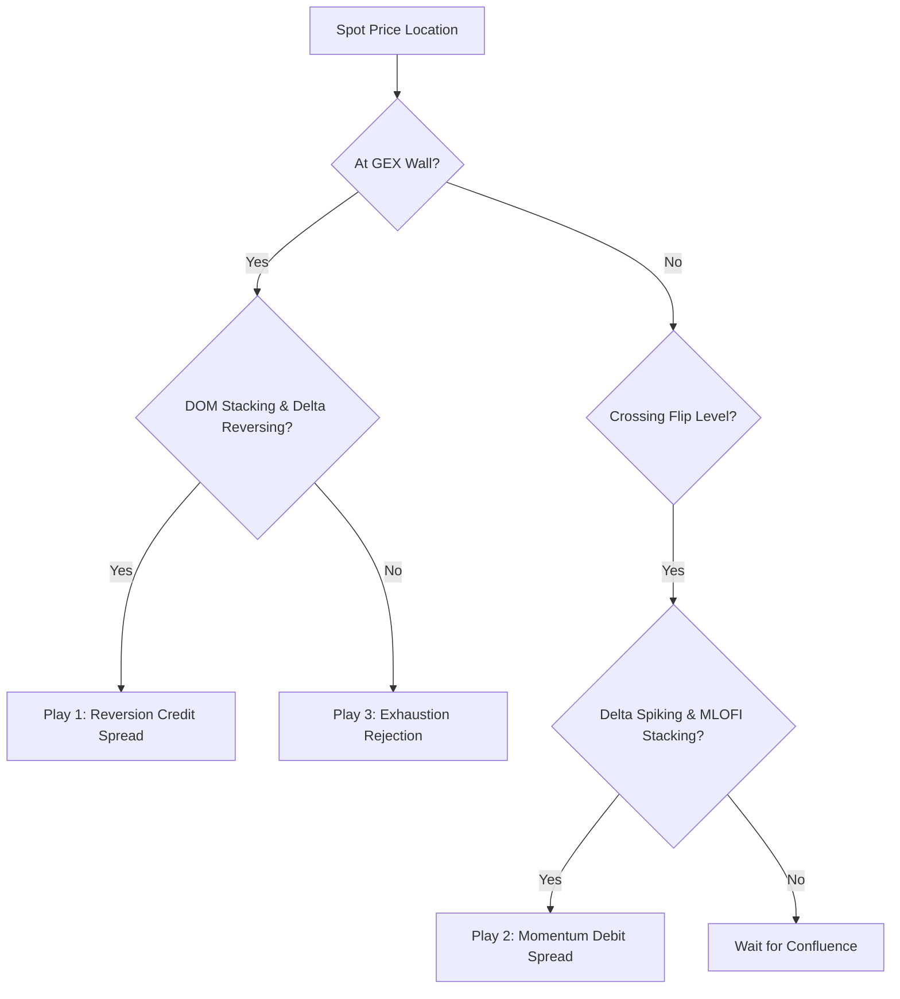

# Actionable Summary Guide: Unified Order Flow & GEX Plays

This guide consolidates multiple data points (GEX, L2 DOM, Bookmap, Footprint) into three simple, high-probability execution plays. Use this as your step-by-step checklist during active market hours.

---

## The 3 Unified Trading Plays

---

### Play 1: Wall Reversion (Mean Reversion)
*Best for Positive Gamma regimes where volatility is suppressed and price tends to pin.*

*   **What you see (The Setup):**
    *   **GEX Level:** Spot price is within $0.25 of a major GEX level (Call Wall or Put Wall).
    *   **LOB Depth (DOM/CoG):** Heavy limit order sizes stack at the wall (DOM size $> 1,000$). The Center of Gravity (CoG) line sits flat, forming a floor/ceiling.
    *   **Execution (Footprint/Delta):** Footprint prints diagonal buying/selling imbalances *into* the wall, but price fails to break. The Cumulative Delta line flattens out, indicating aggressive orders are being absorbed.
*   **Actionable Trade Play:**
    *   **If at Put Wall (Support):** Open a **Bull Put Credit Spread** (Sell ATM Put at the Wall, Buy $1–$2 OTM Put).
    *   **If at Call Wall (Resistance):** Open a **Bear Call Credit Spread** (Sell ATM Call at the Wall, Buy $1–$2 OTM Call).
    *   *Goal:* Collect high premium (theta decay) as the price pins.
*   **Risk Management (Stop Loss):**
    *   Invalidated if the spot price breaks and closes $0.50 beyond the wall, accompanied by limit orders pulling (disappearing) on the DOM.

---

### Play 2: Momentum Sweep (GEX Flip Breakout)
*Best for transitioning into Negative Gamma regimes where volatility expands and trends run fast.*

*   **What you see (The Setup):**
    *   **GEX Level:** Spot price breaks through the GEX Flip Level (regime change point).
    *   **LOB Depth (DOM/CoG):** Limit orders on the DOM ahead of the price start pulling (cancelling). The Center of Gravity (CoG) line slopes sharply in the direction of the break.
    *   **Execution (Footprint/Delta):** Cumulative Delta spikes in the direction of the break. Footprint prints a **stack of 3 consecutive buying/selling imbalances** on the breakout bar. MLOFI rises aggressively, showing bids/asks are chasing the price.
*   **Actionable Trade Play:**
    *   **If breaking above GEX Flip:** Open a **Bull Call Debit Spread** (Buy ATM Call, Sell $2–$3 OTM Call).
    *   **If breaking below GEX Flip:** Open a **Bear Put Debit Spread** (Buy ATM Put, Sell $2–$3 OTM Put).
    *   *Goal:* Capture rapid delta expansion as dealer hedging loops accelerate the trend.
*   **Risk Management (Stop Loss):**
    *   Invalidated if the spot price crosses back across the GEX Flip level and the Cumulative Delta turns negative, signaling a false breakout.

---

### Play 3: Exhaustion Rejection (Sonar Divergence)
*Best for catching trend fatigue and reversals at major price targets (Max Gamma).*

*   **What you see (The Setup):**
    *   **GEX Level:** Spot price runs up close to the **Max Gamma Strike** or Call Wall.
    *   **LOB Depth (DOM/CoG):** A massive limit order block rests at the target strike. The Ask CoG flattens, forming a hard roof.
    *   **Execution (Footprint/Delta):** Large green execution bubbles print on Bookmap (aggressive buying). However, the **Sonar Pulse warning triggers** (Sonar Ratio drops below 0.15), showing that despite aggressive buying, price cannot tick higher because limit sellers are loading the ask faster than buyers can execute.
*   **Actionable Trade Play:**
    *   **If at upside target:** Open a **Bear Call Credit Spread** or buy short-term **OTM Puts** once the first footprint bar closes red with a selling imbalance.
    *   *Goal:* Capture a rapid scalp reversal as buyers run out of ammunition (exhaustion) and passive sellers push the price down.
*   **Risk Management (Stop Loss):**
    *   Invalidated if the massive limit order block on the DOM gets fully transacted (consumed) and price ticks above it, signaling that sellers have been cleared out.
