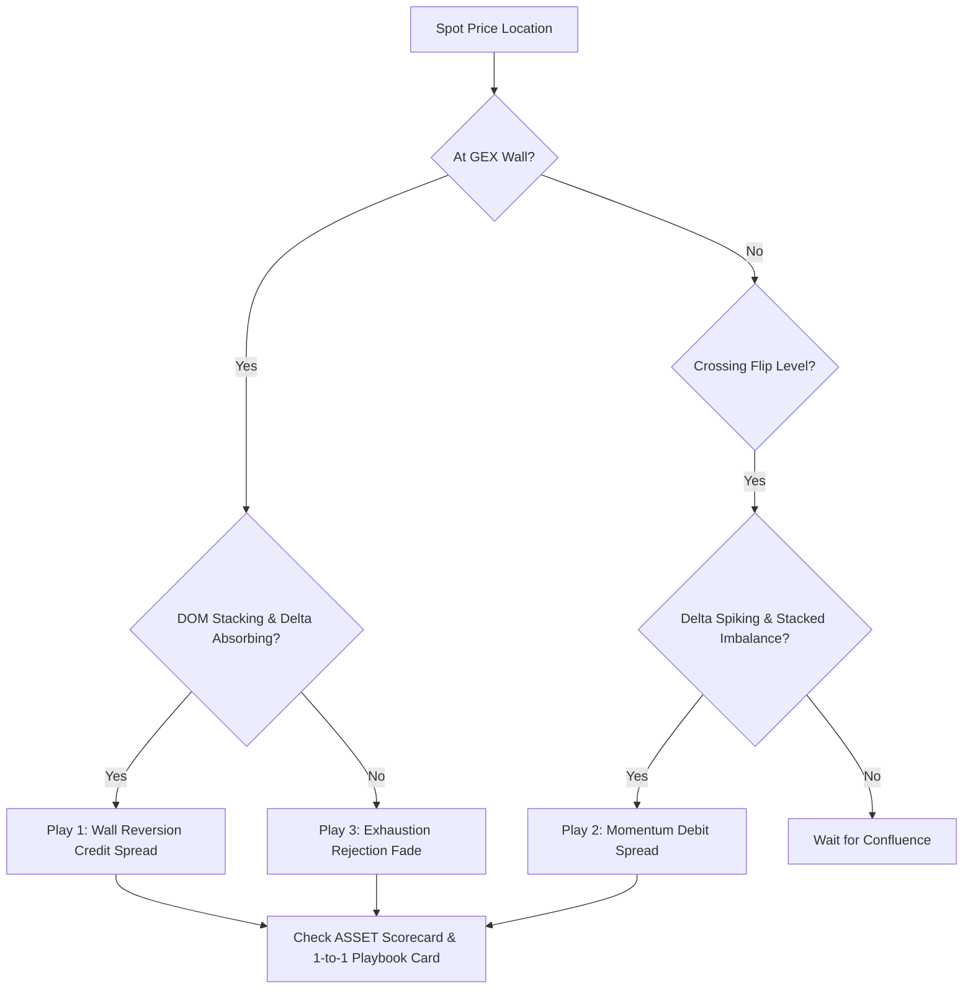

# Actionable Summary Guide: Unified Order Flow & GEX Plays
**Document Version**: 2.0.0 (Living Cumulative Document)  
**System Status**: Production / Active  
**Last Updated**: September 2026 (Release v2.0)  
**Repository**: [syao385/GammaGexTrading](https://github.com/syao385/GammaGexTrading)  

---

## Document Revision & Version Control History

| Version | Date | Author | Description of Changes |
| :--- | :--- | :--- | :--- |
| **v1.0.0** | July 2026 | Desk Engineering | Initial three-play institutional execution playbook (Wall Reversion, Momentum Sweep, Exhaustion). |
| **v1.5.0** | August 2026 | Desk Engineering | Added order book depth stacking and Cumulative Delta confirmation criteria. |
| **v2.0.0** | September 2026 | Desk Engineering | **Cumulative Living Release v2.0**: Integrated the 1-to-1 Option Strategy Playbook with real-time timestamps, analytical rationales, and exact dollar pricing targets; incorporated ASSET Scorecard Grading (A+/A/B/C/D); added Smart Money Concepts (FVG, MSS, Breaker Blocks); and integrated Volume Profile (POC, VAH, VAL) confluences. |

---

## 1. Unified Tactical Decision Flowchart



---

## 2. The 3 Core Execution Plays

### Play 1: Wall Reversion (Mean Reversion)
*Best for Positive Gamma regimes where volatility is suppressed and price tends to pin.*

*   **Setup Conditions:**
    *   **GEX Level:** Spot price is within $\pm 0.50$ of a major GEX Wall (Call Wall or Put Wall).
    *   **LOB Depth (DOM/CoG):** Heavy limit orders stack at the wall (DOM size $> 1,000$). Center of Gravity (CoG) line sits flat, forming a barrier.
    *   **Footprint & Delta:** Footprint prints diagonal selling/buying into the wall, but price stalls. The Cumulative Delta line flattens, confirming aggressive flow is being absorbed.
*   **Actionable Option Execution:**
    *   **At Put Wall (Support):** Open a **Bull Put Credit Spread** (Sell ATM Put at the Wall, Buy \$1–\$2 OTM Put).
    *   **At Call Wall (Resistance):** Open a **Bear Call Credit Spread** (Sell ATM Call at the Wall, Buy \$1–\$2 OTM Call).
    *   *Target:* Collect 80–100% of maximum credit as price pins to the wall.
*   **Risk Management (Stop Loss):**
    *   Invalidated if spot closes $\$0.50$ beyond the wall accompanied by limit orders pulling on the DOM.

---

### Play 2: Momentum Sweep (GEX Flip Breakout)
*Best for transitioning into Negative Gamma regimes where volatility expands and trends run rapidly.*

*   **Setup Conditions:**
    *   **GEX Level:** Spot price decisively breaks through the Gamma Flip level ($S_{\text{Flip}}$).
    *   **LOB Depth (DOM/CoG):** Limit orders ahead of price cancel rapidly (liquidity pulling). CoG line slopes sharply in breakout direction.
    *   **Footprint & Delta:** Cumulative Delta spikes. Footprint prints **$\ge 2$ consecutive stacked diagonal imbalances** on the breakout bar. MLOFI rises aggressively.
*   **Actionable Option Execution:**
    *   **Breaking Above Flip:** Open a **Bull Call Debit Spread** (Buy ATM Call, Sell \$2–\$3 OTM Call).
    *   **Breaking Below Flip:** Open a **Bear Put Debit Spread** (Buy ATM Put, Sell \$2–\$3 OTM Put).
    *   *Target:* 100–150% return on capital as dealer hedging loops accelerate the directional trend.
*   **Risk Management (Stop Loss):**
    *   Invalidated if spot crosses back across the GEX Flip level and Cumulative Delta turns negative.

---

### Play 3: Exhaustion Rejection (Sonar Divergence)
*Best for catching trend exhaustion and reversals at extreme targets (Max Gamma Strike).*

*   **Setup Conditions:**
    *   **GEX Level:** Spot runs into the Max Gamma Strike or an overextended Call Wall.
    *   **LOB Depth (DOM/CoG):** Massive resting limit orders block the target strike. Ask CoG flattens, creating a ceiling.
    *   **Footprint & Delta:** Large green bubbles print on Bookmap, but price fails to tick higher. Sonar Pulse ratio drops below 0.15. Footprint bar closes red with an absorption badge at the high.
*   **Actionable Option Execution:**
    *   Open a **Bear Call Credit Spread** or purchase short-term **OTM Puts**.
    *   *Target:* Rapid mean-reversion scalp back to the 20 EMA or Volume Profile POC.
*   **Risk Management (Stop Loss):**
    *   Invalidated if the limit block on the DOM is fully transacted and price ticks above it.

---

## 3. 1-to-1 Option Strategy Playbook Integration

In v2.0, the GEX Hub features a dedicated **Active Option Execution Playbook** card that synthesizes market data in real time:

1. **Exact Timestamps:** Displays the exact minute the tactical setup was computed.
2. **Setup Rationale:** Provides clear reasoning explaining why the strategy was selected based on GEX regimes, distance from walls, and IV skew.
3. **Specific Strike Targets & Dollar Levels:**
   - **Recommended Strategy Name**: (e.g., *Bull Put Credit Spread*, *Long Straddle*, *Bear Call Spread*).
   - **ATM Anchor Strike**: The exact underlying strike selected for trade initiation.
   - **Profit Target ($)**: Price level where options dealer hedging pressure exhausts.
   - **Stop-Loss Price ($)**: Hard price invalidation level.
4. **ASSET Scorecard Confluence Grade:**
   - **Grade A+ (Score 9.0–10.0)**: Maximum confluence across GEX, Breadth ($ADD/$VOLD), Footprint, and SMC $\rightarrow$ Full Kelly sizing.
   - **Grade A (Score 8.0–8.9)**: Strong structural confluence $\rightarrow$ 75% Kelly sizing.
   - **Grade B (Score 6.5–7.9)**: Moderate confluence $\rightarrow$ 50% Kelly sizing.
   - **Grade C / D (< 6.5)**: Low confluence / chop $\rightarrow$ Reduce size or stay flat.

---

## 4. Smart Money Concepts (SMC) & Multi-Timeframe Confluence

Combine GEX levels with Smart Money Concepts for high-conviction entries:

*   **Fair Value Gaps (FVG):** Look for 3-candle imbalance windows where price skipped liquidity. When an unmitigated Bullish FVG aligns with a Put Wall, it forms an institutional bedrock for long entries.
*   **Market Structure Shift (MSS):** When a swing high/low is breached on high volume immediately after testing a GEX Wall, it confirms trend reversal.
*   **20-Period Exponential Moving Average (EMA 20):** Dynamic short-term trend filter. Long setups require price holding above the 20 EMA; short setups require price below the 20 EMA.
*   **Volume Profile Anchors (POC / VAH / VAL):**
    *   **POC (Point of Control):** Primary magnet during range-bound positive gamma days.
    *   **Value Area Low (VAL):** Support confluence with Put Wall.
    *   **Value Area High (VAH):** Resistance confluence with Call Wall.

---

## 5. Active Market Execution Checklist

```
[ ] 1. Identify Macro Regime: Check Net GEX sign (Positive = Mean Reversion, Negative = Breakout).
[ ] 2. Check GEX Level: Is spot near Put Wall, Call Wall, or GEX Flip?
[ ] 3. Verify Breadth: Are $ADD and $VOLD aligned with trade direction?
[ ] 4. Confirm Order Flow: Check Footprint for diagonal imbalances and Bookmap for resting liquidity.
[ ] 5. Review 1-to-1 Playbook Card: Check Strategy, Timestamps, ASSET Grade, and Pricing Targets.
[ ] 6. Position Sizing: Scale trade according to fractional Kelly recommendations.
[ ] 7. Manage Risk: Hard stop set immediately upon entry; no discretionary slippage.
```