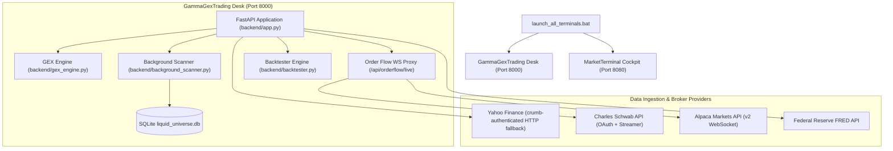

# Gamma GEX & Order Flow Trading System (v2.0)

[](https://github.com/syao385/GammaGexTrading)
[](https://www.python.org/)
[](https://fastapi.tiangolo.com/)
[]()

**Gamma GEX & Order Flow Trading System** is an institutional-grade quantitative options analytics and order flow execution desk. The platform unites second-order options Greeks exposure (GEX, VEX, CEX) and Bayesian probability modeling with micro-structural order flow execution (Bookmap depth heatmaps, Footprint imbalance bars, DOM ladders, and Cumulative Volume Delta).

---

## Document Revision & Version Control History

| Version | Date | Author | Description of Changes |
| :--- | :--- | :--- | :--- |
| **v1.0.0** | July 2026 | Desk Engineering | Initial release: Options GEX curves, Call/Put Walls, Gamma Flip via Brent's method, Greeks modeling, and basic dashboard. |
| **v1.5.0** | August 2026 | Desk Engineering | Order Flow Workstation integration: Bookmap canvas, Consolidated Footprint, DOM Ladder, CVD, and Schwab/Alpaca WebSocket streaming proxy. |
| **v2.0.0** | September 2026 | Desk Engineering | **Cumulative Living Release v2.0**: Overlay candlesticks and Volume Profile onto Bookmap/Footprint; Interactive 30-day Candlestick Price Action chart with 20 EMA, FVGs, and Volume Profile; 1-to-1 Option Strategy Playbook with timestamps, rationales, and pricing targets; Cash vs Options (4.0x leverage) Backtester; Key-based simulator hiding with graceful live fallback; WebSocket proxy queue; SQLite Liquid Universe background scanner; and health-checked `run.bat`. |

---

## 1. System Architecture & Topology

The system operates either standalone or integrated into a multi-desk institutional trading environment:



### Port & Service Directory

| Component | URL / Port | Role / Responsibilities |
| :--- | :--- | :--- |
| **Gamma GEX Web Dashboard** | `http://127.0.0.1:8000` | Primary visual trading cockpit, options curves, order flow workstation, scanners, and backtester. |
| **FastAPI REST & WebSocket API** | `http://127.0.0.1:8000/api/*` | High-performance quantitative calculation endpoints and WebSocket streaming feeds. |
| **SQLite Liquid Universe DB** | `backend/liquid_universe.db` | High-volume persistent store for liquid options setups, GEX metrics, and historical scans. |

---

## 2. Key Modules & Functional Workspaces

### 1. GEX & Market Hub
- **GEX Curves & Profile**: Computes Call GEX, Put GEX, Net GEX across all expiration strikes. Identifies Call Wall (ceiling), Put Wall (floor), and Max Gamma strike.
- **Gamma Flip Calculation**: Uses Brent's root-finding numerical optimization (`scipy.optimize.brentq`) to solve $\sum \text{GEX}_i(S_{\text{Flip}}) = 0$.
- **Second-Order Greeks**: Real-time Vanna Exposure (VEX) for volatility squeezes and Charm Exposure (CEX) for OPEX delta decay.
- **Interactive Daily Candlestick Chart**: Embedded 30-day daily OHLC candlestick chart with 20-period Exponential Moving Average (EMA 20), Fair Value Gap (FVG) highlight zones, and Volume Profile Point of Control (POC).
- **Day Trading Internals & Swing Macro**: Real-time NYSE breadth metrics ($ADD$, $VOLD$, $TICK$), 25-Delta IV Skew, Term Structure, and FRED macroeconomic data (Yield Curve, SKEW Index).
- **1-to-1 Option Strategy Playbook**: Automated tactical card generating exact strategy recommendations (e.g., Bull Put Credit Spread, Bear Call Spread, Long Straddle) with specific timestamps, analytical rationale, probability of profit, and exact dollar pricing targets.

### 2. Order Flow Workstation
- **Bookmap Heatmap**: Visualizes scrolling Level 2 Depth of Market (L2 DOM) liquidity bands with aggressive market order bubbles sized logarithmically by trade volume.
- **Candlestick & Volume Profile Overlays**: Displays candlestick price action and horizontal volume profile histograms directly on the Bookmap canvas.
- **Consolidated Footprint Chart**: Diagonal bid/ask volume comparison, buying/selling stacked imbalances ($\ge 3.0\times$ diagonal ratio), and absorption badges at bar extremes.
- **Cumulative Volume Delta (CVD)**: Real-time cumulative buying vs. selling delta with divergence detection.
- **Live Stream Resiliency**: Asynchronous queue-backed proxy connecting to Charles Schwab and Alpaca with automatic fallback to high-fidelity simulation mode when API credentials are absent or expired.
- **Simulator Visibility Toggle**: Simulator controls automatically hide when authenticated live broker keys are detected.

### 3. Screener & Scanners
- **Automated Liquid Universe Scanner**: High-performance background worker filtering top-volume US equity options for actionable setups (Put Wall Bounces, GEX Flip Breakouts, Volatility Expansions).
- **Smart Money Concepts (SMC)**: Automated detection of Fair Value Gaps (FVG) and Market Structure Shifts (MSS).
- **Interactive Screener Chart Modal**: Instant candlestick modal with 20 EMA, FVG overlays, and Volume Profile for any screened symbol.
- **Direct Symbol Linking**: Clicking any symbol in the Screener or Liquid Universe immediately opens it inside the active GEX Chart.

### 4. Backtester & Lab
- **Dual Asset Class Modes**:
  - **Cash Equity Mode**: Simulates 1.0x underlying equity returns.
  - **Options Mode**: Simulates non-linear options payout dynamics with a calibrated 4.0x effective leverage factor and options-specific stop-loss modeling.
- **Institutional Playbook Strategies**: Put Wall Bounce, Call Wall Reversal, GEX Flip Squeeze, GEX Flip Breakdown, VCP Accumulation, FVG Fill, Breaker Block, and Range Condor.
- **Comprehensive Analytics**: Win rate, profit factor, total return, maximum drawdown, Sharpe ratio, and chronological trade journal.

---

## 3. Quick Start & Execution Guide

### Prerequisites
- Windows 10/11 (or Linux/macOS)
- `uv` package manager (recommended) or Python 3.12+

### One-Click Launch (`run.bat`)
Run the master batch launcher from the project directory:
```bat
run.bat
```
The improved `run.bat` performs:
1. Environment and dependency verification via `uv`.
2. Existing port 8000 detection (prevents duplicate server conflicts).
3. Background initialization of the FastAPI backend in a dedicated console (`cmd /k`).
4. **Dynamic Health Polling**: Actively tests `http://127.0.0.1:8000/` until the server responds with HTTP 200, preventing "This site can't be reached" errors.
5. Launches your default web browser directly to the dashboard.

### Manual Launch via CLI
```bash
uv run --python 3.12 --with fastapi --with uvicorn --with yfinance --with numpy --with scipy --with pandas --with python-multipart --with httpx --with websockets python -m backend.app
```
Access the dashboard at: **`http://127.0.0.1:8000`**

---

## 4. REST & WebSocket API Directory

| Endpoint | Method | Description |
| :--- | :--- | :--- |
| `/` | `GET` | Serves root single-page application dashboard (`frontend/index.html`). |
| `/api/gex/{symbol}` | `GET` | Fetches options chain, calculates GEX/VEX/CEX curves, key walls, and Greeks. |
| `/api/screener/chart-data` | `GET` | Returns 30-day OHLC candles, EMA 20, unmitigated FVGs, and Volume Profile. |
| `/api/screener` | `GET` | Runs real-time screener across watchlist symbols. |
| `/api/screener/liquid-scan` | `GET` | Queries SQLite liquid universe database for scanned setups. |
| `/api/internals/day-trading-snapshot` | `GET` | Intraday breadth snapshot ($ADD$, $VOLD$, $TICK$) and Bayesian probability. |
| `/api/internals/swing-trading-snapshot` | `GET` | Macro swing indicators (VIX, 25-Delta Skew, Yield Curve, SKEW). |
| `/api/strategy/calculate-probability` | `GET` | Computes Bayesian win probability and Kelly criterion position sizing. |
| `/api/backtest` | `GET` | Executes quantitative backtests across cash or options asset classes. |
| `/api/schwab/status` | `GET` | Returns authentication status of Charles Schwab streamer. |
| `/api/alpaca/status` | `GET` | Returns connection status of Alpaca Markets streamer. |
| `/api/orderflow/live` | `WebSocket` | Live bidirectional L2 order book depth and aggressive trade feed. |

---

## 5. Living Project Documentation Index

- **User Guide**: [`userguide.md`](file:///c:/Users/jfan/Documents/GammaGexTrading/userguide.md) – End-to-end operational guide for all workspace tabs, controls, and workflows.
- **Order Flow Manual**: [`ORDER_FLOW_MANUAL.md`](file:///c:/Users/jfan/Documents/GammaGexTrading/ORDER_FLOW_MANUAL.md) – In-depth guide to Footprints, Bookmap heatmaps, DOM ladders, and CVD.
- **Order Flow Playbook**: [`ORDER_FLOW_PLAYBOOK.md`](file:///c:/Users/jfan/Documents/GammaGexTrading/ORDER_FLOW_PLAYBOOK.md) – Step-by-step institutional trade setups, confluences, and execution checklists.
- **Quantitative Glossary**: [`glossary.md`](file:///c:/Users/jfan/Documents/GammaGexTrading/glossary.md) – Mathematical formulations and definitions for all metrics and Greeks.
- **System Design Specification**: [`docs/design_spec.md`](file:///c:/Users/jfan/Documents/GammaGexTrading/docs/design_spec.md) – Technical architecture, module design, and network topology.
- **Functional Specification**: [`docs/functional_spec.md`](file:///c:/Users/jfan/Documents/GammaGexTrading/docs/functional_spec.md) – Comprehensive feature specifications and roadmaps.
- **Implementation Plan**: [`docs/implementation_plan.md`](file:///c:/Users/jfan/Documents/GammaGexTrading/docs/implementation_plan.md) – Component development tracking and milestone log.
- **Verification Walkthrough**: [`docs/walkthrough.md`](file:///c:/Users/jfan/Documents/GammaGexTrading/docs/walkthrough.md) – Automated test suite procedures and verification report.