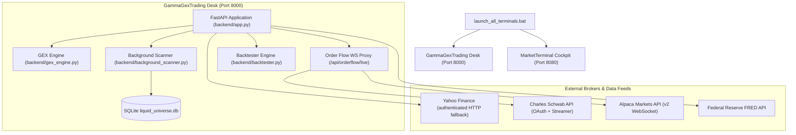

# System Design Specification
**Gamma GEX & Order Flow Trading System**  
**Document Version**: 2.0.0 (Living Cumulative Document)  
**System Status**: Production / Active  
**Last Updated**: September 2026 (Release v2.0)  
**Target Environment**: Institutional Options & Order Flow Desk  
**Repository**: [syao385/GammaGexTrading](https://github.com/syao385/GammaGexTrading)  

---

## Document Revision & Version Control History

| Version | Date | Author | Description of Changes |
| :--- | :--- | :--- | :--- |
| **v1.0.0** | July 2026 | Desk Engineering | Initial architecture: GEX calculations, Greeks modeling, and FastAPI backend service. |
| **v1.5.0** | August 2026 | Desk Engineering | Order Flow Workstation architecture: Bookmap canvas, Footprint rendering, and broker WebSocket proxy. |
| **v2.0.0** | September 2026 | Desk Engineering | **Cumulative Living Release v2.0**: Integrated multi-tab architecture with subtab navigation; Candlestick & Volume Profile overlays on Bookmap canvas; 30-day interactive candlestick chart with EMA 20, FVGs, and Volume Profile; 1-to-1 Option Strategy Playbook with timestamps and pricing targets; Cash vs Options (4.0x leverage) Backtester; Resilient WebSocket proxy queue (`asyncio.Queue`); Automatic simulation fallback; Key-based simulator toggle; SQLite Liquid Universe background scanner; and health-checked `run.bat` launcher. |

---

## 1. High-Level Architecture & Multi-Project Topology

The system operates standalone or in tandem with complementary desk applications:

| Service | Host / Port | Responsibilities | Data Ingestion |
| :--- | :--- | :--- | :--- |
| **GammaGexTrading Desk** | `http://127.0.0.1:8000` | Options GEX/VEX/CEX analytics, Call/Put Walls, Gamma Flip, Bayesian probability engine, Order Flow WebSocket server, Liquid Universe DB scanner, Options Backtester. | Schwab API, Alpaca API, `yfinance`, FRED API |
| **MarketTerminal Cockpit** | `http://127.0.0.1:8080` | Universal Candlestick Data Proxy (`/api/candles`), Market Internals Aggregator, Backtest Engine, Database Journaling. | `yfinance`, Exchange Breadth Feeds |

---

## 2. Detailed Component & Module Design

### 2.1 Backend Modules (`backend/`)

#### 1. `gex_engine.py` (`GEXEngine`)
*   **Responsibilities**: Calculates options Greeks and dollar exposure metrics across all strike prices.
*   **Mathematical Formulations**:
    *   **Black-Scholes Delta ($\Delta$) & Gamma ($\Gamma$)**:
        $$d_1 = \frac{\ln(S/K) + (r + \sigma^2/2)T}{\sigma \sqrt{T}}, \quad \Gamma = \frac{N'(d_1)}{S \sigma \sqrt{T}}$$
    *   **Dollar Gamma Exposure**: $\text{GEX}_i = \pm \Gamma_i \times \text{OI}_i \times S^2 \times 0.01 \times 100$.
    *   **Vanna Exposure (VEX)**: $\text{VEX}_i = -N'(d_1) \frac{d_2}{\sigma} \times \text{OI}_i \times S \times 100$.
    *   **Charm Exposure (CEX)**: $\text{CEX}_i = \frac{\partial \Delta_i}{\partial t} \times \text{OI}_i \times S \times 100$.
*   **Gamma Flip Calculation**: Employs Brent's root-finding method (`scipy.optimize.brentq`) over spot range $[0.5S, 1.5S]$ to find $S_{\text{Flip}}$ where $\sum_i \text{GEX}_i(S_{\text{Flip}}) = 0$.

#### 2. `volume_profile.py` (`VolumeProfileCalculator`)
*   **Responsibilities**: Constructs intraday and daily volume profiles.
*   **Algorithmic Flow**:
    1. Segregates price range $[\text{Low}, \text{High}]$ into 50 uniform price bins.
    2. Aggregates transacted volume per bin.
    3. Identifies **Point of Control (POC)** as the bin holding maximum volume.
    4. Expands outward from POC until 70% of total volume is enclosed, establishing **Value Area High (VAH)** and **Value Area Low (VAL)**.
    5. Detects High Volume Nodes (HVN) and Low Volume Nodes (LVN).

#### 3. `smart_money_detector.py` (`SmartMoneyDetector`)
*   **Responsibilities**: Identifies Institutional Smart Money Concept (SMC) structural setups.
*   **Detections**:
    *   **Fair Value Gaps (FVG)**: Identifies 3-candle imbalance windows. Strict mitigation criteria require a subsequent candle **CLOSE** to penetrate through the gap boundaries.
    *   **Market Structure Shift (MSS)**: Detects breaches of swing highs/lows signaling structural trend flips.
    *   **Order Blocks & Breakers**: Tracks unmitigated institutional order blocks.

#### 4. `internals_calculator.py` (`InternalsCalculator`)
*   **Responsibilities**: Computes trade success probability and optimal position sizing.
*   **Formulation**:
    *   **Prior Probability**: Evaluated via Logistic Regression model incorporating GEX regime, VIX level, and breadth.
    *   **Bayesian Updating**: Sequential Naive Bayes updating based on intraday market breadth ($ADD$, $VOLD$, $TICK$):
        $$P(S|F) = \frac{P(F|S) P(S)}{P(F|S) P(S) + P(F|S^c) P(S^c)}$$
    *   **Kelly Criterion Position Sizing**: Computes optimal capital fraction $f^* = \frac{p(b+1) - 1}{b}$ and scales account equity allocation.

#### 5. `data_fetcher.py` (`DataFetcher`)
*   **Responsibilities**: Ingestion of options chains, risk-free rates, and underlying prices.
*   **Resiliency Features**:
    *   **Crumb-Authenticated HTTP Fallback**: When `yfinance` encounters rate limits or errors, automatically executes direct HTTP requests to Yahoo Finance using session cookies and authenticated crumbs.
    *   **Stale Cache Retrieval**: Employs in-memory caching with graceful stale-data return under upstream outages.
    *   **Fallback Options Chain Generator**: Synthesizes realistic option chains when external APIs are completely offline.

#### 6. `backtester.py` (`Backtester`)
*   **Responsibilities**: Quantitative historical strategy simulation.
*   **Dual Asset Class Engine**:
    *   **Cash Mode (`cash`)**: Simulates 1.0x underlying equity returns.
    *   **Options Mode (`options`)**: Simulates non-linear options returns using a 4.0x leverage multiplier, asymmetric payout modeling, and options-specific stop-loss rules.
*   **Strategies Evaluated**: Put Wall Bounce, Call Wall Reversal, GEX Flip Squeeze/Breakdown, VCP Accumulation, FVG Fill, Breaker Block, and Range Condor.

#### 7. `schwab_streamer.py` & `alpaca_streamer.py`
*   **Responsibilities**: Connects to live broker WebSocket streaming feeds.
*   **Resiliency Features**:
    *   **Asynchronous Message Queue**: Employs `asyncio.Queue(maxsize=1000)` to buffer bursts and prevent connection drops.
    *   **Automatic Fallback to Simulation**: Automatically falls back to high-fidelity simulation mode if authentication fails or keys are missing.
    *   **Dynamic Re-Subscription**: Automatically re-subscribes to new tickers when changed in the frontend.

#### 8. `database.py` & `background_scanner.py`
*   **Responsibilities**: SQLite persistence (`backend/liquid_universe.db`) and scheduled background scanner.
*   **Automated Scheduling**: Automatically scans 1,000+ optionable US stocks every weekday at 8:30 AM EST.

---

## 3. Frontend Architecture (`frontend/`)

### 3.1 Layout & Navigation
*   **Collapsible Sidebar**: Compact menu toggle expanding and collapsing the main navigation.
*   **Right-Side Y-Axis**: All price labels placed on the right chart margins for standard trading desk alignment.
*   **Gridline Toggles**: Global display controls for chart grids.

### 3.2 Canvas Renderers
*   **Bookmap Canvas (`drawBookmap`)**: Renders L2 DOM depth heat, logarithmic trade bubbles, candlestick overlays, and Volume Profile histograms.
*   **Footprint Canvas (`drawFootprint`)**: Renders volume-shaded Bid/Ask sub-boxes, POC borders, stacked imbalance bands, absorption badges, and net delta footers.
*   **Interactive Candlestick Chart (`drawCandlestickChart`)**: 30-day daily OHLC candles, EMA 20 line, FVG rectangular zones, and Volume Profile POC.

---

## 4. Startup & Operations Architecture (`run.bat`)

*   **Directory Anchoring**: `cd /d "%~dp0"` guarantees execution in the project root.
*   **Active Health Polling**: Replaced static sleep with dynamic curl loop polling `http://127.0.0.1:8000/` until HTTP 200 is confirmed before opening the browser.
*   **Port In-Use Detection**: Detects if port 8000 is already active to prevent duplicate process conflicts.
*   **Persistent Console (`cmd /k`)**: Keeps server terminal window open for continuous log inspection.