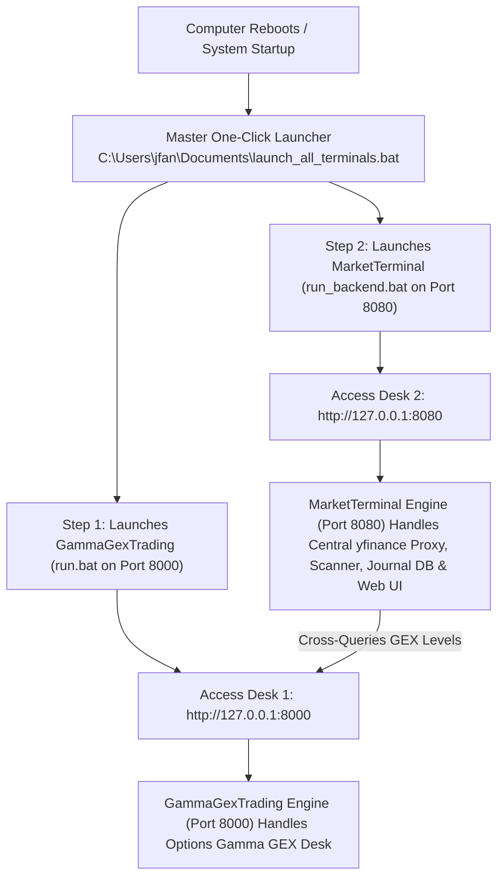

# Gamma GEX Trading System - User Guide
**Document Version**: 2.0.0 (Living Cumulative Document)  
**System Status**: Production / Active  
**Last Updated**: September 2026 (Release v2.0)  
**Repository**: [syao385/GammaGexTrading](https://github.com/syao385/GammaGexTrading)  

---

## Document Revision & Version Control History

| Version | Date | Author | Description of Changes |
| :--- | :--- | :--- | :--- |
| **v1.0.0** | July 2026 | Desk Engineering | Initial institutional release: GEX Curves, Call/Put Walls, Gamma Flip point, Net GEX by Strike, and basic single-stock analytics. |
| **v1.5.0** | August 2026 | Desk Engineering | Order Flow Workstation launch: Bookmap Heatmap canvas, Consolidated Footprint chart, DOM ladder, and Cumulative Volume Delta (CVD). |
| **v2.0.0** | September 2026 | Desk Engineering | **Cumulative Living Release v2.0**: Integrated multi-tab architecture with subtab pills; Daily Candlestick chart on GEX Hub (EMA 20, FVGs, Volume Profile); 1-to-1 Option Strategy Playbook with timestamps, rationales, and pricing targets; Cash vs Options (4.0x leverage) Backtester; Screener Candlestick modal; Candlestick & Volume Profile overlays on Bookmap/Footprint; Key-based simulator hiding with graceful fallback; WebSocket proxy queue; and robust health-checked `run.bat`. |

---

## 0. Multi-Project System Architecture, Port Registry & Startup Sequence

When your computer reboots or when launching the trading systems, follow the sequence below:



### Complete Port & URL Directory

| Trading Project | Local Service URL | Port | Launcher Script Path | Project Functionality |
| :--- | :--- | :--- | :--- | :--- |
| **GammaGexTrading Desk** | **`http://127.0.0.1:8000`** | **`8000`** | `C:\Users\jfan\Documents\GammaGexTrading\run.bat` | **Options Gamma GEX Desk**. Computes zero-gamma, call wall, and put wall levels. MarketTerminal cross-queries Port 8000 for level reuse. |
| **MarketTerminal Cockpit** | **`http://127.0.0.1:8080`** | **`8080`** | `C:\Users\jfan\Documents\MarketTerminal\run_backend.bat` | **Main Algorithmic Trading Terminal**. Hosts Web UI (`/`), Central `yfinance` Candlestick Proxy (`/api/candles`), Indicators (`/api/metrics`), Universal Scanner (`/api/scanner`), Database Journal (`/api/journal`), and Backtesting Lab. |

---

### How to Launch on System Reboot

#### Method A: Master One-Click Launch (Recommended)
1. Navigate to **`C:\Users\jfan\Documents\`**.
2. Double-click **`launch_all_terminals.bat`**.
3. It will automatically start **GammaGexTrading (Port 8000)** and **MarketTerminal (Port 8080)** in sequence and open your browser!

#### Method B: Individual Standalone Launch
- **To launch GammaGexTrading alone**:
  1. Open folder `C:\Users\jfan\Documents\GammaGexTrading\`.
  2. Double-click **`run.bat`**.
  3. The launcher script performs dependency checks, verifies port 8000, starts the background server, polls the health endpoint until ready, and launches **`http://127.0.0.1:8000`**.

---

## 1. System Navigation & Workspace Structure

The v2.0 interface features a **collapsible left navigation sidebar** with four major hubs and modular sub-tab navigation:

1. **📊 GEX & Market Hub** (`data-tab="gex-hub"`):
   - **GEX Curves & Playbook**: Core options curves, walls, flips, 1-to-1 playbook, and daily candlestick action.
   - **Day Trading Internals**: Real-time market breadth dials ($ADD, $VOLD, $TICK, $TRIN), Bayesian probability engine, and Day-to-Swing transition evaluator.
   - **Swing Macro Metrics**: Net Fed Liquidity, SKEW & VIX/VXV term structure, 50D/200D breadth, and OPEX countdown.
2. **⚡ Order Flow Workstation** (`data-tab="order-flow"`):
   - Consolidated Footprint Chart with stacked imbalances and absorption highlights.
   - Bookmap Heatmap with candlestick and Volume Profile overlays.
   - DOM Ladder and Cumulative Volume Delta (CVD).
   - Live stream broker integration (Schwab / Alpaca) with resilient queuing.
3. **🔍 Screener & Scanners** (`data-tab="scanners-hub"`):
   - Watchlist Screener with alert history logs and direct symbol navigation.
   - Liquid Universe Scanner with SQLite persistence and setup badges.
   - Interactive Candlestick Modal for fast multi-timeframe review.
4. **📈 Backtester & Lab** (`data-tab="backtesting-lab"`):
   - Historical multi-strategy options/cash backtester with 4.0x option leverage modeling.

---

## 2. GEX & Market Hub Detailed Guide

### 2.1 GEX Curves & Structural Levels
- **Spot vs. GEX Flip**: Displays proximity to the zero-gamma regime transition point ($S_{\text{Flip}}$).
- **Call Wall & Put Wall**:
  - **Call Wall**: Resistance ceiling where dealers are short calls and must sell stock on rallies.
  - **Put Wall**: Structural support floor where dealers are long puts and must buy stock on dips.
- **Max Gamma Strike**: Primary pinning magnet during expiration cycles.
- **Vanna (VEX) & Charm (CEX) Sidebars**:
  - *Vanna*: Assesses volatility squeeze velocity ($\partial \Delta / \partial \sigma$).
  - *Charm*: Assesses time decay delta unwinding ($\partial \Delta / \partial t$) as expiration nears.

### 2.2 Daily Candlestick Price Action Chart
Directly embedded below the GEX curves:
- **30-Day Daily Candlesticks**: Accurate OHLC visualization with wick/body scaling.
- **20 EMA Line**: Green dynamic line showing short-term structural trend support/resistance.
- **Fair Value Gap (FVG) Highlight Zones**: Shaded cyan/magenta rectangular bands showing unmitigated liquidity imbalances where institutional buying or selling skipped auction price levels.
- **Volume Profile POC**: Highlighted horizontal level marking the highest volume price node over the period.

### 2.3 1-to-1 Option Strategy Playbook
- **Real-Time Timestamps**: Displays exact calculation timestamp for every recommended play.
- **Actionable Strategic Rationale**: Explains why the setup is valid based on GEX regimes, distance from walls, and volatility skew.
- **Exact Strike & Pricing Targets**: Outputs ATM strike, suggested spread width, target profit, and hard stop-loss level.
- **Confluence Score & Grade**: Displays institutional ASSET confluence grade (Grade A+, A, B, C, D) and probability of profit.

### 2.4 Day Trading Internals
- **NYSE Breadth Dials**:
  - **$ADD (Breadth)**: Net advancing vs. declining issues. Bullish if $> +500$, Bearish if $< -500$.
  - **$VOLD (Volume Flow)**: Up-volume to down-volume ratio. Strong trend when $> 2.0\text{x}$ or $< 0.5\text{x}$.
  - **$TICK (Momentum)**: Extreme readings ($\pm 1000$) indicate exhaustion extremes and reversal potential.
  - **$TRIN (Arms Index)**: Bullish if $< 0.8$, Bearish if $> 1.2$.
- **Bayesian Probability Engine & Kelly Sizing**: Calculates posterior win rates based on breadth confluences and generates fractional Kelly position sizing recommendations.
- **Day-to-Swing Transition Helper**: Evaluates Relative Close Strength (RCS) at 3:45 PM EST to determine whether to hold or close cash.

### 2.5 Swing Macro Metrics
- **Federal Reserve Net Liquidity Overlay**: Tracks S&P 500 correlation against central bank reserves ($Reserves = Assets - TGA - RRP$).
- **VIX / VXV Term Structure & SKEW**: Identifies contango vs. backwardation regimes and institutional tail-risk hedging.
- **50D / 200D Moving Average Breadth**: Measures market participation breadth to detect exhaustion tops and bottoms.

---

## 3. Order Flow Workstation Detailed Guide

### 3.1 Bookmap Heatmap Canvas
- **L2 DOM Depth Heat**: Color-coded liquidity bands displaying resting limit orders across time.
- **Execution Bubbles**: Aggressive market orders scaled logarithmically (Green = Lifted Offer, Red = Hit Bid).
- **Candlestick Overlay**: Real-time candlestick price action plotted directly over the heatmap.
- **Volume Profile Histogram Overlay**: Horizontal volume bars aligned to the price scale on the right axis.
- **Right Margin Padding**: Calibrated padding ensuring all price scale labels remain fully visible.

### 3.2 Consolidated Footprint Chart
- **Bid / Ask Volume Sub-Boxes**: Displays volume split at every price bucket with color-intensity shading.
- **Point of Control (POC)**: Purple-bordered bucket marking the heaviest volume level in each bar.
- **Stacked Imbalances ($\ge 3.0\times$)**:
  - Green bands: Aggressive buying sequence lifting diagonal offers.
  - Red bands: Aggressive selling sequence hitting diagonal bids.
- **Absorption Badges (`ABS`)**: Highlights institutional passive absorption at bar extremes.
- **Net Delta Footers**: Explicit net buying/selling delta printed at the base of each bar.

### 3.3 DOM Ladder & Advanced Metrics
- **Depth of Market (DOM)**: Real-time resting limit order quantities centered around current trade price.
- **LOB Center of Gravity (CoG)**: Volume-weighted price of resting liquidity tracking support/resistance shelves.
- **MLOFI (Modified Limit Order Flow Imbalance)**: Stacking rate of bids vs. asks.
- **Dealer Hedging Speedometer**: Real-time hedging flow velocity (shares/min).

### 3.4 Live Streaming & Simulation Controls
- **Live Providers**: Supports Charles Schwab and Alpaca Markets via WebSocket.
- **Resilient Queuing**: Asynchronous proxy buffer prevents frame drops and UI freezes under heavy market flow.
- **Automatic Fallback**: If API credentials are missing or invalid, the system automatically falls back to High-Fidelity Simulation mode without crashing.
- **Simulator Hiding**: When live broker credentials are authenticated, simulation scenario buttons are automatically hidden.
- **Symbol Auto-Reconnect**: Changing the active ticker in the global search instantly re-subscribes the live stream to the new symbol.

---

## 4. Screener & Scanners Detailed Guide

### 4.1 Watchlist Manager & Technical Alerts
- Real-time screening across your customized watchlist.
- Filter by setup types: Bullish Alerts, Bearish Alerts, UOA Outliers, and Wall Proximity.
- Direct click navigation: Click any symbol to immediately load its full GEX profile.

### 4.2 Interactive Screener Candlestick Modal
- Click the chart icon next to any ticker in the Screener table to open an instant 30-day candlestick modal.
- Includes 20-day EMA, Fair Value Gap (FVG) rectangles, and Volume Profile with POC.

### 4.3 SQLite Liquid Universe Scanner
- Background engine scanning 1,000+ liquid US optionable equities into `backend/liquid_universe.db`.
- Setup badges: `VCP` (Volatility Contraction), `Breakout`, `Trend Cont`, `Mean Rev`, and `Vol Spike`.
- Automated daily scan at 8:30 AM EST before market open.

---

## 5. Backtester & Lab Detailed Guide

### 5.1 Dual Asset Class Simulation Modes
- **Cash Mode (`cash`)**: Evaluates performance using standard 1.0x underlying equity price returns.
- **Options Mode (`options`)**:
  - Simulates non-linear options returns using a 4.0x effective leverage multiplier.
  - Implements asymmetric options payouts (capped loss on debits, theta decay, and defined-risk spread dynamics).
  - Employs dedicated options stop-loss parameters.

### 5.2 Strategy Engine Library
- `put_wall_bounce`: Mean reversion longs off institutional Put Walls.
- `call_wall_reversal`: Mean reversion shorts off Call Walls.
- `gex_flip_squeeze`: Volatility breakout longs above the Gamma Flip level.
- `gex_flip_breakdown`: Volatility trend shorts below the Gamma Flip level.
- `vcp_accumulation`: Contraction breakout plays.
- `fvg_fill`: Smart Money Concept Fair Value Gap retest plays.
- `breaker_block`: Order block mitigation setups.
- `range_condor`: Iron Condor / delta-neutral range plays during positive gamma regimes.
- `max_gamma_exhaustion`: Mean reversion fading at peak gamma pinning strikes.

---

## 6. Daily Operational Checklist

```
08:00 - 09:30 EST | PRE-MARKET
[ ] Launch Desk via run.bat (http://127.0.0.1:8000)
[ ] Check Fed Net Liquidity & VIX/VXV Term Structure on Swing tab
[ ] Review 8:30 AM Liquid Universe Scan results
[ ] Note OPEX expiration cycle days remaining

09:30 - 15:30 EST | ACTIVE MARKET
[ ] Monitor $ADD and $VOLD breadth dials on Day Trading tab
[ ] Check GEX Hub for spot distance to Call/Put Walls and GEX Flip
[ ] Confirm entries on Order Flow tab: Footprint POC, stacked imbalances, DOM CoG
[ ] Execute 1-to-1 Option Strategy Playbook setups with Grade A/B confluences

15:30 - 16:00 EST | CLOSE & TRANSITION
[ ] At 3:45 PM EST, run Day-to-Swing Transition Helper
[ ] Verify Relative Close Strength (RCS >= 0.85 for longs)
[ ] Hold high-probability overnight swings or close cash before the 4:00 PM bell
```