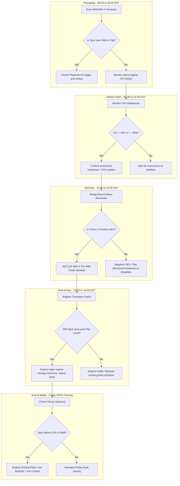

# Gamma GEX Trading System - User Guide

This user guide describes how to operate each tab and widget of the Gamma Gex dashboard and outlines a step-by-step workflow for integrating GEX metrics into your daily trading routine.

---

## 1. System Workflow Flowchart

The following flowchart outlines how to use the GEX Trading System during different phases of the trading cycle.

---

## 2. Dashboard Tabs & Widgets Instructions

### Tab 1: Live GEX Profile
This is the primary analysis dashboard for detailed single-stock execution.
*   **Quick Stats Banner**: 
    *   *Spot Price vs. GEX Flip*: Shows how close the stock is to flipping its volatility regime.
    *   *Call Wall & Put Wall*: Highlights the structural boundaries.
    *   *GEX Volatility Regime*: Displays if the stock is in a Positive (low vol) or Negative (high vol) environment.
*   **Active GEX Strategy Playbook**: Automatically reads the Spot, Walls, and Flip levels to recommend **only** strategies where the price is currently at the strike trigger.
*   **Net Dealer GEX by Strike Chart**: Visualizes the total positive and negative GEX at each strike. Look for clusters of bars—large clusters act as strong magnets or barriers.
*   **Vanna & Charm Sidebar Charts**:
    *   *Vanna Chart (VEX)*: Shows how dealer exposure changes if IV rises/falls. Use to spot Vanna squeeze setups (steep curves near spot).
    *   *Charm Chart (CEX)*: Shows how dealer delta decay accelerates over time. Extremely useful during expiration weeks.

### Tab 2: Market Screener
Used for scanning your entire watchlist simultaneously.
*   **Watchlist Manager**: Add or remove symbols using the pill-badges (saved in your local browser).
*   **Filter Alerts Dropdown**: Filter your scan results for specific setups (e.g., show only tickers with *Bullish Alerts*, *Bearish Alerts*, *UOA*, or *Wall Proximity*).
*   **Collapsible Rows**: Click on any row in the screener table to expand its sub-panel. This displays the **full Alert History Log with timestamps** and details like total Net GEX, Vanna, and Charm.
*   **OS Desktop Notifications**: Native notifications will pop up on your Windows desktop whenever a new GEX, Order Flow, or Price Action alert fires.

### Tab 3: GEX Validator
Validates self-calculated GEX profiles against commercial CSV files (FlashAlpha, OptionsFlow, Quantwheel).
1.  Enter the ticker symbol.
2.  Choose the external CSV file.
3.  Click **Execute Validation Analysis** to see the Pearson correlation coefficient and Mean Absolute Error (MAE). (Look for correlation $> 0.85$ for high confidence).

### Tab 4: Strategy Backtester
Allows you to run simulations on synthetic GEX/OVI options proxies over the past year.
*   Select the ticker, strategy type (GEX Flip, OVI Breakout, Wall Reversion), and trade parameters.
*   Click **Run Backtest Simulation** to view metrics: Total Return, Sharpe Ratio, Max Drawdown, and Equity Curve.

### Tab 5: Order Flow Execution
Provides micro-level execution confirmation (real-time order flow) around key macro GEX levels.
*   **Data Feed Mode Dropdown**: Toggle between High-Fidelity Simulation (for scenario-based training) and Live feeds (Charles Schwab or Alpaca Markets).
*   **Consolidated Footprint Chart**: Displays aggressive trade executions grouped into price buckets showing **Bid Volume (Sells) | Ask Volume (Buys)**.
    *   *POC (Point of Control)*: Outlined in purple; indicates the price bucket with the highest transacted volume in that bar.
    *   *Diagonal Imbalances*: Highlighted in Green (Buy Imbalance) or Red (Sell Imbalance) when ask/bid size exceeds its diagonal counterpart by $\ge 3.5\times$.
*   **Bookmap Heatmap & Cumulative Delta**:
    *   *Heatmap Background*: Visualizes limit order book depth (resting orders). Bright orange bands indicate heavy resting limit orders (liquidity walls).
    *   *Trade Bubbles*: Circles represent aggressive market order executions. Green represents buy orders; red represents sell orders. Sizes are scaled logarithmically.
    *   *Cumulative Delta sub-chart*: Displays the running divergence between aggressive buying and aggressive selling volume.
*   **DOM Ladder (Depth of Market)**: 
    *   *Bid Size Column*: Lists the number of limit buy contracts/shares resting at prices below the last traded price.
    *   *Price Column*: The center column indicating price ticks. The active price row is highlighted.
    *   *Ask Size Column*: Lists the number of limit sell contracts/shares resting at prices above the last traded price.

### Tab 1B: Day Trading Dashboard
Designed for real-time market-hours trend and momentum checks.
*   **Live Market Internals Dials**: Plotted via dynamic needles showing:
    *   *$ADD (Breadth)*: Net advancing vs. declining stock count. Bullish if $> +500$, bearish if $< -500$.
    *   *$VOLD (Volume Flow)*: Ratio of up-volume vs. down-volume. Bullish if $> 1.5\text{x}$, bearish if $< 0.7\text{x}$.
    *   *$TICK (Momentum)*: Uptick vs. downtick count. Panic spikes at $\pm 1000$ signal reversion.
    *   *$TRIN (Arms Index)*: Volume-breadth ratio. Bullish if $< 0.8$, bearish/panic if $> 1.2$.
    *(Note: If the market is closed, dials are parked and display "Closed" to prevent false signals).*
*   **Bayesian & Kelly Assistant**: Uses Logistic Regression and Sequential Bayesian updates of TICK and VOLD flows to output trade success probabilities, recommending fractional Kelly capital sizing and risk multipliers.
*   **Day-to-Swing Transition Helper**: Run at 3:45 PM EST. Input your trade entry price to calculate **Relative Close Strength (RCS)**. If the checklist passes (RCS $\ge 0.85$ for longs, negative gamma regime support, no upcoming morning catalysts, and a safe distance from dealer walls), the banner flashes **HOLD SWING OVERNIGHT**; otherwise, it advises **EXIT DAY TRADE (CLOSE CASH)**.

### Tab 1C: Swing Trading Dashboard
Provides leading indicators for macroeconomic turning points and structural trends.
*   **Federal Reserve Net Liquidity Chart**: Overlays S&P 500 close against central bank liquidity ($Reserves = Balance Sheet - TGA - RRP$). High correlation identifies liquidity-driven tops and bottoms.
*   **VIX / VXV Term Structure & SKEW Chart**: Traces tail risk and front-to-back month volatility ratios. Ratio $> 1.0$ flags backwardation (extreme risk/panic), while SKEW peaks ($> 140$) warn of tail-risk hedging.
*   **Market Breadth Chart**: Tracks percentage of stocks trading above 50-day (medium-term) and 200-day (long-term) moving averages. Tops $> 80\%$ flag overextensions; bottoms $< 20\%$ indicate market capitulation.
*   **OPEX Expiration Calendar**: Counts down days remaining until monthly option expirations (3rd Friday of each month), alerting you to dealer delta/charm unwinding cycles.
*   **Debt & Spreads Widgets**: Tracks yield curve steepening (10Y - 3M spread) and ICE BofA High-Yield credit spreads to evaluate systemic market distress.

### Tab 1D: Liquid Universe Scanner
Scans the 1,000+ most liquid optionable assets (Large-Caps, Mid-Caps, Nasdaq 100, and retail leaders) for high-probability setups.
*   **Triggered Technical Setups**: Categorizes stocks using badges for:
    *   `VCP`: Contraction patterns with volume dry-ups indicating tight consolidation before a breakout.
    *   `Breakout`: Breach of Call Walls or 20-day range highs on heavy volume.
    *   `Trend Cont`: Pullbacks to rising/falling 20-day EMAs or Flip support under dry volume.
    *   `Mean Rev`: Testing Put/Call walls or overextended Z-scores from the 20-day EMA.
    *   `Vol Spike`: Outlier volume sweeps or options unusual activity (UOA) ratios.
*   **Rebuild DB**: Triggers the background worker. Scanning 1,000+ tickers takes ~2 minutes with API throttling. A progress bar tracks completion.

### Rebuild DB Job Scheduler
The database rebuild runs automatically at **8:30 AM EST every weekday** in the background. 
*   **Edit or Disable the Python Scheduler**: Edit variables `AUTO_REBUILD_ENABLED` and `AUTO_REBUILD_TIME_EST` in `backend/background_scanner.py`.
*   **Edit or Disable the Agent Cron**: Ask the AI assistant to list schedules, or type *"Kill schedule task-262"* in the chat to disable it.

---

## 3. How to Read and Interpret the DOM Ladder & Order Flow
Operate the DOM Ladder, Footprint, and Bookmap widgets as a unified execution system:

1.  **Liquidity Stacking (Support/Resistance Shelves)**: 
    *   Look at the DOM Ask Size and Bid Size columns. If a price level displays a massive size (e.g., 1,500 vs. typical 80 at other levels), a large limit order is resting there.
    *   On the **Bookmap Heatmap**, this matches a thick **horizontal orange band**. 
    *   *Trading Action*: Expect the price to stall or bounce here. Do not enter a long position right below a large Ask block unless you see it getting actively consumed.
2.  **Liquidity Pulling (Cancelled Orders / Spoofing)**:
    *   If the spot price approaches a resting limit size on the DOM, watch if the size rapidly decreases (e.g., from 1,200 to 40) without corresponding executions (bubbles).
    *   *Trading Action*: This indicates a seller/buyer pulling their order. The barrier has collapsed, making it highly likely that price will break through that level easily.
3.  **Bid-Ask Ratio Imbalance (Order Book Skew)**:
    *   Compare the cumulative volume of the top 5 bid rows vs. top 5 ask rows on the DOM.
    *   A high Bid-Ask ratio (bids outweighing asks) indicates buy-side support. If the **Cumulative Delta line** is also trending up, buyers are aggressively taking liquidity.
4.  **Footprint Imbalance Stack (Breakout Confirmation)**:
    *   When the spot price breaks a GEX Flip Level or a Wall, look at the **Footprint Chart**.
    *   If you see 3 consecutive green highlight cells stacked vertically on a breakout bar, it confirms institutional aggressive buying momentum. This confirms a high-probability breakout entry.

---

## 4. Advanced Order Flow Metrics & Confluence Assistant
To make reading multiple order book indicators easy and actionable, the system calculates and displays advanced metrics that bridge GEX, DOM, and Price Action:

1.  **LOB Center of Gravity (CoG):**
    *   *Formula:* Calculated as the volume-weighted average price of resting liquidity over the top 5 bid and ask rows:
        \[\text{CoG} = \frac{\sum (Price \cdot Size)}{\sum Size}\]
    *   *Visual:* Displayed as a dotted green line (Bid CoG support path) and a dotted red line (Ask CoG resistance path) directly on the Bookmap timeline.
    *   *Interpretation:* If Bid CoG rises alongside price, passive buyers are stepping up bids to support the trend. If Ask CoG falls during a bounce, sellers are blocking price from rising.
2.  **Modified Limit Order Flow Imbalance (MLOFI):**
    *   *Formula:* Sums the delta change of resting contracts at the top 5 DOM levels to measure book stacking velocity:
        \[\text{MLOFI} = \Delta \text{Bids} - \Delta \text{Asks}\]
    *   *Visual:* Highlighted numerically in the sidebar and plotted as a secondary orange line chart on the Cumulative Delta timeline.
    *   *Interpretation:* Positive values indicate limit bids are stacking faster than asks (buying pressure); negative values indicate offers are stacking (selling pressure).
3.  **Real-Time Dealer Hedging Pressure (Speedometer):**
    *   *Formula:* Maps price momentum and options dealer gamma multipliers (e.g. Negative GEX accelerates price speed, Positive GEX dampens price speed) into shares/min hedging flow velocity.
    *   *Visual:* The rotating needle and numerical dial on the sidebar speedometer card.
    *   *Interpretation:* Points left (red) during aggressive short-hedging cover runs; points right (green) during dealer buying hedge expansions.
4.  **Sonar Pulse Divergence:**
    *   *Formula:* Evaluates the ratio of market execution volume relative to absolute limit size shifts over a 10-tick rolling window.
    *   *Visual:* Flashes an orange warning banner on the Bookmap canvas.
    *   *Interpretation:* Triggers if the market is executing heavy buying volume but price stops moving higher due to a massive passive wall of institutional sellers. It warns you to **stay flat / avoid chasing**.
5.  **Footprint Candlestick Pattern Triggers:**
    *   Scans the wicks and bodies of footprint bars to identify standard Price Action reversal patterns in real-time (Hammers, Shooting Stars, Bullish/Bearish Engulfing, Marubozus).
6.  **Confluence Playbook Assistant:**
    *   Combines **GEX Levels (The Map)**, **Order Flow (The Engine)**, and **Price Action (The Trigger)** to output setup confluences (e.g. *Wall Reversion support*, *Flip breakouts*) with a percentage confidence rating and a direct options trade recommendation.

---

## 5. Time-Phased Operational Playbook (Step-by-Step)

Follow this systematic checklist throughout the daily and weekly cycles to orchestrate the Day Trading, Swing Trading, and Liquid Universe Scanner dashboards together.

### 1. Premarket & After-Hours (08:00 - 09:30 EST)
During this phase, compile your macro map and scan the universe for structural setups:
*   [ ] **Review Macro Liquidity (Swing Tab)**: Open the **Swing Trading Dashboard** and inspect the **Federal Reserve Net Liquidity** overlay. Observe if central bank reserves are expanding or contracting relative to the S&P 500 index. If liquidity is dropping, reduce overall swing exposure.
*   [ ] **Verify Volatility Structure (Swing Tab)**: Check the **VIX / VXV Term Structure** chart. Ensure the ratio is in *Contango* ($< 1.0$). If it flips into *Backwardation* ($> 1.0$), it indicates extreme front-month panic hedging—prepare for a volatile trend day. Check **SKEW**; readings $> 140$ signal institutional black-swan tail hedging.
*   [ ] **Scan the Universe (Liquid Scanner Tab)**: 
    *   Click **Rebuild DB** to run the daily background scan. 
    *   The progress bar in the bottom right will show scanning progress (e.g. `20 / 125`). *Wait about 2 minutes for the scan to complete.*
    *   Once complete, use the **Filter Setup** dropdown to scan for **VCP (Volatility Contraction Pattern)** consolidate setups or **Breakout** candidates. Select the high-probability candidates and add them to your watchlist.
*   [ ] **Plan Expirations (Swing Tab)**: Check the **OPEX Expiration Calendar** to note if a major monthly options expiration is occurring this week. Days ending in $< 5$ indicate imminent dealer position unwinding, leading to high volatility or pinning behavior.

### 2. Market Hours Intraday (09:30 - 15:30 EST)
Active monitoring of momentum, delta-hedging flows, and execution triggers:
*   [ ] **Monitor Market Internals (Day Trading Tab)**:
    *   The dials for **$ADD**, **$VOLD**, **$TICK**, and **$TRIN** will now be active (showing real numbers and moving needles).
    *   *Breadth check ($ADD / $VOLD)*: If $ADD is positive ($> +500$) and $VOLD is $> 1.5\text{x}$, trade only **long breakouts**. If $ADD$ is negative ($< -500$) and $VOLD$ is $< 0.7\text{x}$, trade only **short breakdowns**.
    *   *Momentum check ($TICK)*: If $TICK$ reaches extreme panic values ($\pm 1000$), look for immediate mean reversion triggers at dealer walls.
*   [ ] **Assess Setup Probability (Day Trading Tab)**: Type your target symbol (e.g. `TSLA`) in the sidebar search. If the price approaches a key GEX level, select the strategy and check the **Bayesian Probability Ring**. If the posterior probability is $> 65\%$, check the recommended **Kelly sizing** fraction (e.g. 8.5% allocation) and risk multiplier.
*   [ ] **Confirm via Order Flow (Order Flow Tab)**: Switch to the **Order Flow Execution** tab to execute:
    *   Confirm the entry using the **Footprint POC** and diagonal buy/sell imbalances.
    *   Verify if limit buyers are stacking contracts on the DOM ladder (**MLOFI** is positive).
    *   Place a tight stop-loss 1 tick past the structural Put/Call Wall.

### 3. End-of-Day Transition (15:30 - 16:00 EST)
Decide whether to hold active day trades overnight or close them to cash:
*   [ ] **Evaluate Transitions (Day Trading Tab)**: At 3:45 PM EST, enter your trade details in the **Day-to-Swing Transition Helper**:
    *   Input your **Entry Price** and select **Long** or **Short** direction.
    *   Click **Evaluate**.
    *   *Review the checklist*: Ensure **Relative Close Strength (RCS)** is $\ge 0.85$ (for longs) or $\le 0.15$ (for shorts), and that the **Catalyst Check** passes (no high-importance macro alerts or earnings scheduled for tomorrow morning).
    *   *Decision*: If the banner flashes green **HOLD SWING OVERNIGHT**, swing the position. If it flashes red **EXIT DAY TRADE (CLOSE CASH)**, flatten the book before the 4:00 PM EST bell.

### 4. Weekends & Market Closed
Perform strategy reviews, backtesting, and pipeline maintenance:
*   [ ] **Review Performance**: Assess the previous week's trades against GEX support/resistance walls.
*   [ ] **Run Backtests (Backtester Tab)**: Backtest GEX and OVI signals over historical data to optimize your win-rate thresholds.
*   [ ] **Check Inactive State**: Dials on the Day Trading Dashboard will read **Closed** with needles parked at `0` (straight up), and the probability engine will show **Inactive**. Watchlist relative strengths will display the last calculated daily percentage change vs. SPY (e.g. Friday close performance).
*   [ ] **Update Alpaca Credentials**: Ensure your Developer credentials display the green **Configured** status badge on the settings panel. If they are configured, they are saved locally on disk and do not need to be re-entered.

