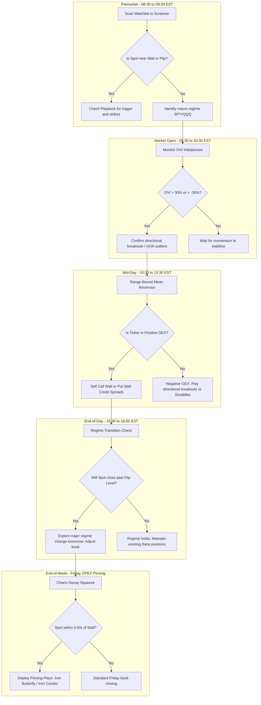

# Gamma GEX Trading System - User Guide

This user guide describes how to operate each tab and widget of the Gamma Gex dashboard and outlines a step-by-step workflow for integrating GEX metrics into your daily trading routine.

---

## 1. System Workflow Flowchart

The following flowchart outlines how to use the GEX Trading System during different phases of the trading cycle.

---

## 2. Dashboard Tabs & Widgets Instructions

### Tab 1: Live GEX Profile
This is the primary analysis dashboard for detailed single-stock execution.
*   **Quick Stats Banner**: 
    *   *Spot Price vs. GEX Flip*: Shows how close the stock is to flipping its volatility regime.
    *   *Call Wall & Put Wall*: Highlights the structural boundaries.
    *   *GEX Volatility Regime*: Displays if the stock is in a Positive (low vol) or Negative (high vol) environment.
*   **Active GEX Strategy Playbook**: Automatically reads the Spot, Walls, and Flip levels to recommend **only** strategies where the price is currently at the strike trigger.
*   **Net Dealer GEX by Strike Chart**: Visualizes the total positive and negative GEX at each strike. Look for clusters of bars—large clusters act as strong magnets or barriers.
*   **Vanna & Charm Sidebar Charts**:
    *   *Vanna Chart (VEX)*: Shows how dealer exposure changes if IV rises/falls. Use to spot Vanna squeeze setups (steep curves near spot).
    *   *Charm Chart (CEX)*: Shows how dealer delta decay accelerates over time. Extremely useful during expiration weeks.

### Tab 2: Market Screener
Used for scanning your entire watchlist simultaneously.
*   **Watchlist Manager**: Add or remove symbols using the pill-badges (saved in your local browser).
*   **Filter Alerts Dropdown**: Filter your scan results for specific setups (e.g., show only tickers with *Bullish Alerts*, *Bearish Alerts*, *UOA*, or *Wall Proximity*).
*   **Collapsible Rows**: Click on any row in the screener table to expand its sub-panel. This displays the **full Alert History Log with timestamps** and details like total Net GEX, Vanna, and Charm.
*   **OS Desktop Notifications**: Native notifications will pop up on your Windows desktop whenever a new alert crosses the threshold.

### Tab 3: GEX Validator
Validates self-calculated GEX profiles against commercial CSV files (FlashAlpha, OptionsFlow, Quantwheel).
1.  Enter the ticker symbol.
2.  Choose the external CSV file.
3.  Click **Execute Validation Analysis** to see the Pearson correlation coefficient and Mean Absolute Error (MAE). (Look for correlation $> 0.85$ for high confidence).

### Tab 4: Strategy Backtester
Allows you to run simulations on synthetic GEX/OVI options proxies over the past year.
*   Select the ticker, strategy type (GEX Flip, OVI Breakout, Wall Reversion), and trade parameters.
*   Click **Run Backtest Simulation** to view metrics: Total Return, Sharpe Ratio, Max Drawdown, and Equity Curve.

---

## 3. Daily Execution Checklist

### 1. Premarket (08:30 - 09:30 EST)
*   [ ] Open the **Market Screener** and click **Scan Watchlist**.
*   [ ] Filter alerts by **Wall Proximity** and **Flip Proximity** to identify which watchlisted stocks are opening near major inflection levels.
*   [ ] Check the stats banner of **SPY** and **QQQ** to establish the macro volatility regime (Positive vs. Negative Gamma). If the indices are in Negative Gamma, expect a high-volatility trend day.
*   [ ] Check the **Active GEX Strategy Playbook** for your target symbols to note exact trigger prices.

### 2. Market Open (09:30 - 10:30 EST)
*   [ ] Monitor the **OVI (Intraday)** column in the screener. Look for OVI spikes ($> 30\%$ or $< -30\%$).
*   [ ] Expand rows for stocks showing OVI imbalances to verify if **Unusual Option Activity (UOA)** volume exceeds open interest.
*   [ ] If a stock is in Negative Gamma, breaks the GEX Flip level, and shows high call OVI, buy ATM **Bull Call Debit Spreads** as recommended in the playbook.

### 3. Mid-Day (10:30 - 15:30 EST)
*   [ ] In a **Positive Gamma** environment, prices tend to mean-revert. If Spot touches the Put Wall or Call Wall:
    *   Open **Put Wall Credit Spreads (Bull Put)** at the Put Wall.
    *   Open **Call Wall Credit Spreads (Bear Call)** at the Call Wall.
*   [ ] Collect theta decay. Exit positions if the spot breaks and closes outside the walls.

### 4. End-of-Day (15:30 - 16:00 EST)
*   [ ] Monitor the close relative to the GEX Flip Level. 
*   [ ] If a stock is closing below the GEX Flip point (moving from Positive to Negative Gamma), close range-bound credit spreads immediately. Volatility will expand overnight.

### 5. End-of-Week (Friday monthly OPEX)
*   [ ] Identify stocks pinned close to a major Call/Put Wall.
*   [ ] Under Positive Gamma, deploy **Iron Condors** or **Iron Butterflies** centered exactly on the Call/Put Wall to extract maximum time decay (Charm) as the stock pins on the close.
